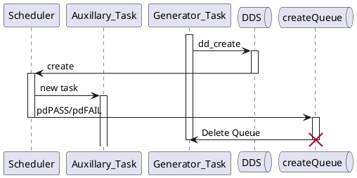
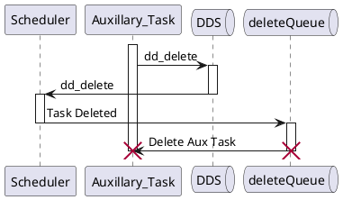
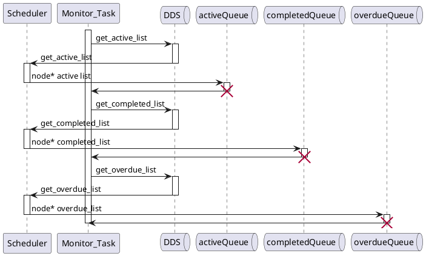

#Diagram for Deadline Driven Scheduler

##Task Creation

```plantuml
@startuml
    participant Scheduler as Scheduler
    participant Auxillary_Task as Aux
    participant Generator_Task as Generator
    queue       DDS         as DDS
    queue       createQueue as createQueue
    activate Generator
    Generator ->  DDS: dd_create 
    activate DDS       
    DDS -> Scheduler : create
    deactivate DDS
    activate Scheduler
    Scheduler -> Aux : new task
    activate Aux
    Scheduler -> createQueue : pdPASS/pdFAIL
    deactivate Scheduler
    activate createQueue
    createQueue -> Generator : Delete Queue
    destroy createQueue
    deactivate Generator
@enduml
```

## Task Deletion

```plantuml
@startuml
    participant Scheduler as Scheduler
    participant Auxillary_Task as Aux
    queue       DDS         as DDS
    queue       deleteQueue as deleteQueue
    activate Aux
    Aux -> DDS: dd_delete
    activate DDS
    DDS -> Scheduler : dd_delete
    deactivate DDS
    activate Scheduler
    Scheduler -> deleteQueue : Task Deleted
    
    deactivate Scheduler
    activate deleteQueue
    deleteQueue -> Aux : Delete Aux Task
    destroy deleteQueue
    destroy Aux
@enduml
```

##Monitor Update

```plantuml
@startuml
    participant Scheduler as Scheduler
    participant Monitor_Task  as Monitor
    queue       DDS         as DDS
    queue       activeQueue as activeQueue
    queue       completedQueue as completedQueue
    queue       overdueQueue as overdueQueue
    activate Monitor
    Monitor -> DDS : get_active_list
    activate DDS
    DDS -> Scheduler : get_active_list
    deactivate DDS
    activate Scheduler
    Scheduler -> activeQueue : node* active list
    deactivate Scheduler
    activate activeQueue
    activeQueue -> Monitor
    destroy activeQueue

    Monitor -> DDS : get_completed_list
    activate DDS
    DDS -> Scheduler : get_completed_list
    deactivate DDS
    activate Scheduler
    Scheduler -> completedQueue : node* completed_list
    deactivate Scheduler
    activate completedQueue
    completedQueue -> Monitor
    destroy completedQueue

    Monitor -> DDS : get_overdue_list
    activate DDS
    DDS -> Scheduler : get_overdue_list
    deactivate DDS
    activate Scheduler
    Scheduler -> overdueQueue : node* overdue_list
    deactivate Scheduler
    activate overdueQueue
    overdueQueue -> Monitor
    destroy overdueQueue
    deactivate Monitor
@enduml
```

```plantuml
@startuml
component DD_Scheduler{

}
rectangle dd_create
rectangle dd_delete
rectangle dd_return_active_list
rectangle dd_return_completed_list
rectangle dd_return_overdue_list
component Task_Generator
component Task_Monitor
component Auxillary_Task
queue DDS_queue
queue create_queue
queue delete_queue
queue active_list_queue
queue completed_list_queue
queue overdue_list_queue
DD_Scheduler <- DDS_queue
dd_create -> DDS_queue
dd_delete -> DDS_queue
dd_return_active_list -> DDS_queue
dd_return_completed_list -> DDS_queue
dd_return_overdue_list -> DDS_queue
DD_Scheduler -> create_queue
DD_Scheduler -> delete_queue
DD_Scheduler -> active_list_queue
DD_Scheduler -> overdue_list_queue
DD_Scheduler -> completed_list_queue
Task_Generator -> dd_create
Task_Monitor -> dd_return_active_list
Task_Monitor -> dd_return_completed_list
Task_Monitor -> dd_return_overdue_list


@enduml
```